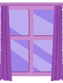
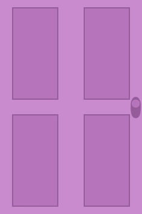
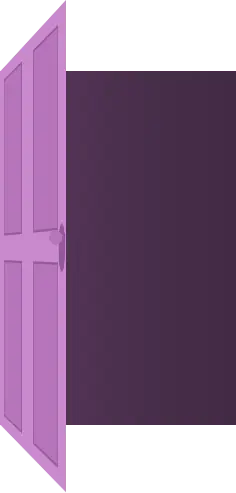

# vilinh27-rooms

I wanted a website entirely for me. I can show all things from code to crafts. Something self indulgent really that i can play with more than a portfolio. Something i dont have to overthink. The theme is based on an artist group I like called Envy Green Manor. Each collection (of clothes) they release is themed into a room added to the manor. They are unfortunately closing, so I thought this would be a fun chance to comemorate them in my own way. You as the user get to choose which door to enter, which represents which discipline to explore, from code, to art, to ux or even crafts.

# Process

## User flow

Link to draw.io flow chart: https://app.diagrams.net/#Dme-site_2025.drawio#%7B%22pageId%22%3A%22lhPDe5OhCmLXhX0DRedJ%22%7D

## Figma low fidelity prototype.

Link to figma lofi prototype:

## Assets for Final site.

### Sound on icon

### Sound off icon

### Light Mode Icon

### Dark Mode Icon

### Fun Font Icon

### Dyslexia Friendly Font Icon

### Window for Nav bar

### Door closed

### Door Open

### Tibia stationary

### Tibia waving

## Fonts

Fun Font: https://fonts.google.com/specimen/Courier+Prime?query=courier

Dyslexia friendly font: https://fonts.google.com/specimen/Lexend

## Audio Credits

Rainy days _Final Version_ (Acoustic/Piano) by M-Murray -- https://freesound.org/s/695951/ -- License: Attribution 4.0

Pop 9 by D.S.G. -- https://freesound.org/s/328119/ -- License: Creative Commons 0

unlock_door.wav by fuzzpapi -- https://freesound.org/s/147347/ -- License: Creative Commons 0

open close old window with birds outside sound effect by Garuda1982 -- https://freesound.org/s/553474/ -- License: Attribution 4.0

-Edited using : https://audiomass.co

## Placeholder image credits

https://www.vecteezy.com/png/48096241-ornate-vintage-brass-keyhole-plate-on-transparent-background

https://pikwizard.com/png/elegant-brass-key-in-keyhole-on-transparent-background/b80f9838a4c625a97e7e5e4d4fa1520e/

## Notes

### The Sound Toggle and decoupling it from the MusicDog component

Both these components help in creating a state control that's reachable from everything in the app (also why we wrap the App in index with SoundProvider ).

Once SoundCOntext and SoundProivder elements like toggleSound and isSoundOn is reachable thorughout the app, we don't have to pass around a bunch props, which is more scalable (we don't have to constantly remember passing a bunch of props when adding more compoennts).

#### Sound Context

The new sound context component will manage the main sound mode stuff so Sounttoggle doesn't do too many things at once.

#### Sound Provider

Provider component inside sound context works for sound context in managing sound mode from the looks of it.

#### Music Dog Audio decoupling

SoundToggle componenet doesn't need to directly interact with music dog's audio now that it can globally handle isSoundOn and toggleSound so the components aren't as brittle if something changes.

#### App.js being the center of command of sound stuff

The main thing this file does for sound is manage directly the background music for the dog. The useEffect used for playing/pausing the audio is gonna depend on two things now: isPlaying (local state for whether dog button pressed or not), and isSoundOn from the context thing.

So if the music dog button is pressed, the music plays only if th global sound on setting is active.

If the user toggles sound off via sound toggle (the component), music mutes, even if music dog is dancing.

If the user toggles sound on again, the music starts again if music dog was set to playing.
