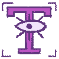

# vilinh27-rooms

I wanted a website entirely for me. I can show all things from code to crafts. Something self indulgent really that i can play with more than a portfolio. Something i dont have to overthink. The theme is based on an artist group I like called Envy Green Manor. Each collection (of clothes) they release is themed into a room added to the manor. They are unfortunately closing, so I thought this would be a fun chance to comemorate them in my own way. You as the user get to choose which door to enter, which represents which discipline to explore, from code, to art, to ux or even crafts.

# Process

## User flow

Link to draw.io flow chart: https://app.diagrams.net/#Dme-site_2025.drawio#%7B%22pageId%22%3A%22lhPDe5OhCmLXhX0DRedJ%22%7D

## Figma low fidelity prototype.

Link to figma lofi prototype:

## Assets for Final site.

### Sound on icon

### Sound off icon

### Light Mode Icon

### Dark Mode Icon

### Fun Font Icon

### Dyslexia Friendly Font Icon

### Window for Nav bar

### Door closed

### Door Open

### Tibia stationary

### Tibia waving

## Fonts

Fun Font: https://fonts.google.com/specimen/Courier+Prime?query=courier

Dyslexia friendly font: https://fonts.google.com/specimen/Lexend
